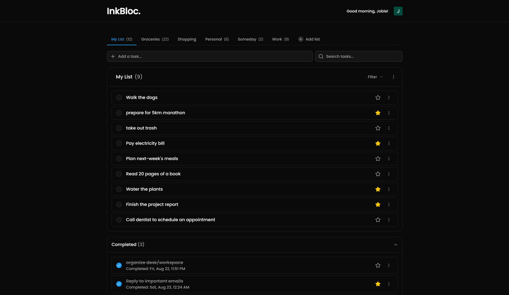
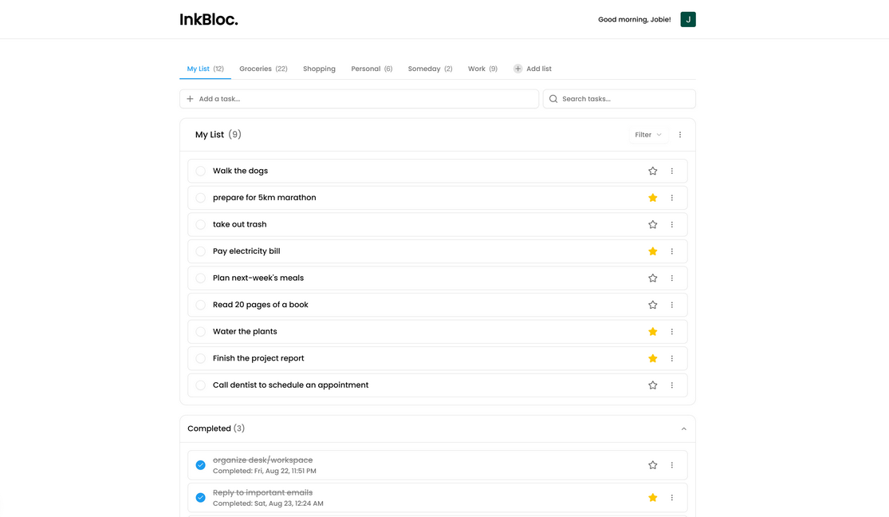

# InkBloc - Fullstack Minimalist Todo App

A fullstack minimalist todo app built for simplicity, speed, and focus. InkBloc helps you manage your tasks with ease while keeping the interface distraction-free.

## 🌐 Live Demo

Explore InkBloc live 👉 [inkbloc.vercel.app](https://inkbloc.vercel.app)

## ✨ Features

| Function                         | Description                                         |
| :------------------------------- | :-------------------------------------------------- |
| Authentication                   | Sign up, login, and secure sessions                 |
| Email Verification               | Ensure account security with Resend                 |
| Forgot & Reset Password          | Recover your account seamlessly                     |
| Dark Mode                        | Seamless light/dark theme toggle                    |
| List & Task CRUD                 | Create, update, and manage multiple lists and todos |
| Mark Important Tasks             | Filter by important vs non-important                |
| Auto Grouping of Completed Tasks | Stay focused on what’s pending                      |
| Dark Mode                        | Seamless light/dark theme toggle                    |
| Search Tasks                     | Quickly find what matters                           |
| Form Validations                 | Reliable and user-friendly forms                    |
| Responsive Design                | Optimized for desktop, tablet, and mobile.          |
| Animations                       | Beautiful transitions powered by Framer Motion.     |

## 🛠 Tech Stack

| Tech Stack                                      | Description                                   |
| :---------------------------------------------- | :-------------------------------------------- |
| [Next.js](https://nextjs.org/)                  | React framework with SSR support              |
| [TypeScript](https://www.typescriptlang.org/)   | Strongly typed JavaScript                     |
| [Tailwind CSS](https://tailwindcss.com/)        | Utility-first styling                         |
| [shadcn/ui](https://ui.shadcn.com/)             | Accessible and customizable UI components     |
| [Framer Motion](https://www.framer.com/motion/) | Smooth animations and transitions             |
| [React Hook Form](https://react-hook-form.com/) | Form validations                              |
| [Better Auth](https://better-auth.com/)         | Authentication & Authorization                |
| [Prisma](https://www.prisma.io/)                | Database ORM                                  |
| [Neon](https://neon.com/)                       | Postgres database platform                    |
| [Resend](https://resend.com/)                   | Email delivery (verification, reset password) |

## 🚀 Getting Started

**Fork this repo**
You can fork this repo by clicking the fork button in the top right corner of this page.

**Clone on your local machine**

```bash
git clone https://github.com/engrjvramos/inkbloc.git
```

**Navigate to project directory**

```bash
cd inkbloc
```

**Create a new branch**

```bash
git checkout -b my-new-branch
```

**Install dependencies**

```bash
pnpm install
```

**Run the development server**

```bash
pnpm run dev
```

Visit [http://localhost:3000](http://localhost:3000) to see the app in action.

## 📷 Screenshots




## 🤝 Contributing

Contributions are welcome! If you’d like to improve **InkBloc**, please fork the repo and submit a PR.

## 📄 License

This project is open-source under the MIT License. Feel free to fork, modify, and build upon it.
